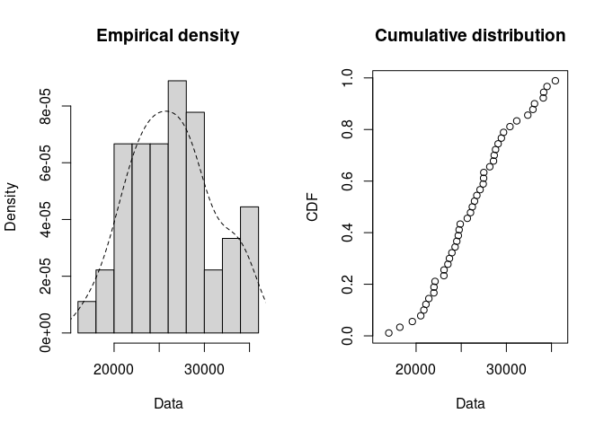

United States Presidents Birth and Death Information Dataset
================
B. Henderson
2022-11-26

This report details the findings of an exploratory analysis of a
presidential dataset using the R programming language and supporting
packages. From this dataset, the top ten longest lived and shortest
lived presidents were found. Then, the mean, median, mode, maximum,
minimum, and standard deviation were calculated using the lifespan in
days of each president. Finally, each president’s lifespan was placed on
a plot to illustrate the distribution.

## Exploratory Analysis

For this analysis, the following packages will be loaded:

``` r
library(dplyr)
library(lubridate)
library(modeest)
library(ggplot2)
library(fitdistrplus)
```

Raw data is read into a dataframe for further processing.

``` r
raw <- read.csv("data/U.S. Presidents Birth and Death Information - Sheet1.csv")
```

The reference information is saved, and the raw data is cleaned.

``` r
reference_info <- raw$PRESIDENT[46]

cleaned <- raw |>
  #remove the 46th row which is reference information
  head(45) |>
  transmute(#unify naming conventions
            president = PRESIDENT,
            #convert chr BIRTH.DATE to Date type
            birth_date = mdy(BIRTH.DATE),
            birth_place = BIRTH.PLACE,
            death_date = mdy(DEATH.DATE),
            #ifelse ensures NA is placed in living president rows
            death_place = ifelse((LOCATION.OF.DEATH == ""), NA, LOCATION.OF.DEATH))

#free raw memory
rm(raw)
```

Cleaned data is enriched with the new columns year_of_birth,
lived_years, lived_months, and lived_days.

``` r
#parse the date that the dataset was accessed to use for calculations
accessed_date <- reference_info |> mdy()
enriched <- cleaned |>
  #use birth_date and death_date to create year_of_birth, lived_years, lived_months, and lived_days columns
  mutate(year_of_birth = year(birth_date),
         #if there isn't a death_date, use the accessed date for calculation completion
         lived_years = interval(birth_date, coalesce(death_date, accessed_date)) / years(1),
         lived_months = interval(birth_date, coalesce(death_date, accessed_date)) / months(1),
         lived_days = interval(birth_date, coalesce(death_date, accessed_date)) / days(1))

rm(cleaned)
```

The enriched data is used to create a top ten longest lived presidents
table.

``` r
ten_longest_lived <- enriched |>
  arrange(desc(lived_days)) |>
  mutate(#round lived_years to 1 decimal point for presentation
         lived_years = round(lived_years, 1),
         #round lived_months to 3 or 4 significant figures to roughly match lived_years
         lived_months = round(lived_months, 0),
         #round lived_days to 4 significant figures to avoid the appearance of false equality
         lived_days = round(lived_days, -1)) |>
  head(10)
```

**Top 10 Longest Lived Presidents**

| president        | birth_date | birth_place        | death_date | death_place           | year_of_birth | lived_years | lived_months | lived_days |
|:-----------------|:-----------|:-------------------|:-----------|:----------------------|--------------:|------------:|-------------:|-----------:|
| Jimmy Carter     | 1924-10-01 | Plains, Georgia    | NA         | NA                    |          1924 |        97.0 |         1164 |      35430 |
| George Bush      | 1924-06-12 | Milton, Mass.      | 2018-11-30 | Houston, Texas        |          1924 |        94.5 |         1134 |      34500 |
| Gerald Ford      | 1913-07-14 | Omaha, Nebraska    | 2006-12-26 | Rancho Mirage, Cal.   |          1913 |        93.5 |         1121 |      34130 |
| Ronald Reagan    | 1911-02-06 | Tampico, Illinois  | 2004-06-05 | Los Angeles, Cal.     |          1911 |        93.3 |         1120 |      34090 |
| John Adams       | 1735-10-30 | Quincy, Mass.      | 1826-07-04 | Quincy, Mass.         |          1735 |        90.7 |         1088 |      33120 |
| Herbert Hoover   | 1874-08-10 | West Branch, Iowa  | 1964-10-20 | New York, New York    |          1874 |        90.2 |         1082 |      32940 |
| Harry S. Truman  | 1884-05-08 | Lamar, Missouri    | 1972-12-26 | Kansas City, Missouri |          1884 |        88.6 |         1064 |      32370 |
| James Madison    | 1751-03-16 | Port Conway, Va.   | 1836-06-28 | Orange Co., Va.       |          1751 |        85.3 |         1023 |      31150 |
| Thomas Jefferson | 1743-04-13 | Albemarle Co., Va. | 1826-07-04 | Albemarle Co., Va.    |          1743 |        83.2 |          999 |      30400 |
| Richard Nixon    | 1913-01-09 | Yorba Linda, Cal.  | 1994-04-22 | New York, New York    |          1913 |        81.3 |          975 |      29690 |

The enriched data is also used to create a top ten shortest lived
presidents table.

``` r
ten_shortest_lived <- enriched |>
  arrange(lived_days) |>
  mutate(#round lived_years to 1 decimal point for presentation
         lived_years = round(lived_years, 1),
         #round lived_months to 3 significant figures to match lived_years
         lived_months = round(lived_months, 0),
         #round lived_days to 4 significant figures to match the first table
         lived_days = round(lived_days, -1)) |>
  head(10)
```

**Top 10 Shortest Lived Presidents**

| president          | birth_date | birth_place           | death_date | death_place          | year_of_birth | lived_years | lived_months | lived_days |
|:-------------------|:-----------|:----------------------|:-----------|:---------------------|--------------:|------------:|-------------:|-----------:|
| John F. Kennedy    | 1917-05-29 | Brookline, Mass.      | 1963-11-22 | Dallas, Texas        |          1917 |        46.5 |          558 |      16980 |
| James A. Garfield  | 1831-11-19 | Cuyahoga Co., Ohio    | 1881-09-19 | Elberon, New Jersey  |          1831 |        49.8 |          598 |      18200 |
| James K. Polk      | 1795-11-02 | Mecklenburg Co., N.C. | 1849-06-15 | Nashville, Tennessee |          1795 |        53.6 |          643 |      19580 |
| Abraham Lincoln    | 1809-02-12 | LaRue Co., Kentucky   | 1865-04-15 | Washington, D.C.     |          1809 |        56.2 |          674 |      20520 |
| Chester Arthur     | 1829-10-05 | Fairfield, Vermont    | 1886-11-18 | New York, New York   |          1829 |        57.1 |          685 |      20860 |
| Warren G. Harding  | 1865-11-02 | Morrow County, Ohio   | 1923-08-02 | San Francisco, Cal.  |          1865 |        57.7 |          693 |      21090 |
| William McKinley   | 1843-01-29 | Niles, Ohio           | 1901-09-14 | Buffalo, New York    |          1843 |        58.6 |          704 |      21410 |
| Barack Obama       | 1961-08-04 | Honolulu, Hawaii      | NA         | NA                   |          1961 |        60.2 |          722 |      21970 |
| Theodore Roosevelt | 1858-10-27 | New York, New York    | 1919-01-06 | Oyster Bay, New York |          1858 |        60.2 |          722 |      21980 |
| Calvin Coolidge    | 1872-07-04 | Plymouth, Vermont     | 1933-01-05 | Northampton, Mass.   |          1872 |        60.5 |          726 |      22100 |

Using the lived_days column from enriched data, create a summary
statistics table.

``` r
#precalculate the mode vector to simplify mode code below
mode_vector = mfv(enriched$lived_days)
summary_statistics <- tibble(#keep significant figures equal to lived_days underlying data
                             mean = round(mean(enriched$lived_days), 0),
                             #weighted mean is not used because the error associated with each measurement is unknown
                             median = median(enriched$lived_days),
                             #for table presentation, set mode to None when the mode returned is all of the lived_days
                             mode = if(all(sort(mode_vector) == sort(enriched$lived_days)))
                                      "None"
                                    else
                                      mode_vector,
                             max = max(enriched$lived_days),
                             min = min(enriched$lived_days),
                             #match number of significant figures to above results
                             standard_deviation = round(sd(enriched$lived_days), 1))
```

**Presidential Lived Days Summary Statistics**

|  mean | median | mode |   max |   min | standard_deviation |
|------:|-------:|:-----|------:|------:|-------------------:|
| 26364 |  26227 | None | 35426 | 16978 |               4564 |

Use the lived days for all presidents to create empirical density and
cumulative distribution plots to further describe the distribution.

``` r
enriched$lived_days |>
  #superimpose the density plot on the histogram
  plotdist(histo = TRUE, demp = TRUE)
```

<!-- -->

## Conclusion

According to the data derived from PresidentsUSA.net, the average
president lives around 26,400 days with a standard deviation of about
4,560 days. So far, no United States presidents have ended up with equal
lifespans in whole days, and 26,200 days approximates the midpoint of
all presidential lifespans. Outlier President Jimmy Carter continues to
add to the top presidential lifespan of approximately 35,400 days, and
outlier President John F. Kennedy remains the shortest lived president
in history at around 17,000 days.

## References

Birthplace, Birthdate, and Death information of the U.S. Presidents.
(n.d.). PresidentsUSA.Net. Retrieved September 28, 2021, from
<https://www.presidentsusa.net/birth.html>  
Statistics Explained. (n.d.). eurostat. Retrieved November 27, 2022,
from
<https://ec.europa.eu/eurostat/statistics-explained/index.php?title=Tutorial%3ARounding_of_numbers#Tables>  
Libretexts. (2022, May 22). 13.1: Basic statistics- mean, median,
average, standard deviation, Z-scores, and P-value. Engineering
LibreTexts. Retrieved November 26, 2022, from
<https://eng.libretexts.org/Bookshelves/Industrial_and_Systems_Engineering/Book%3A_Chemical_Process_Dynamics_and_Controls_(Woolf)/13%3A_Statistics_and_Probability_Background/13.01%3A_Basic_statistics-_mean%2C_median%2C_average%2C_standard_deviation%2C_z-scores%2C_and_p-value>
